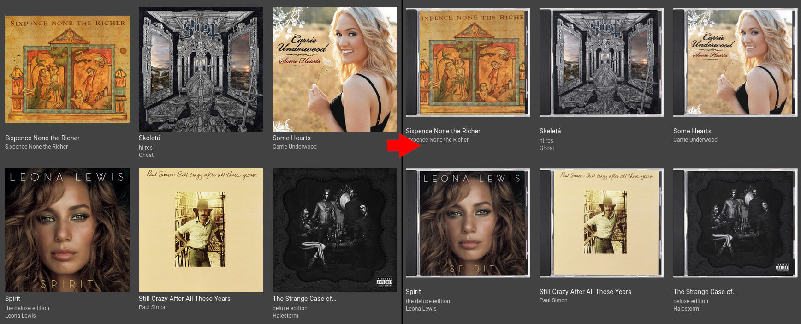
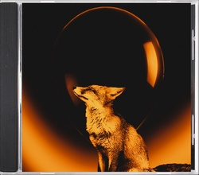
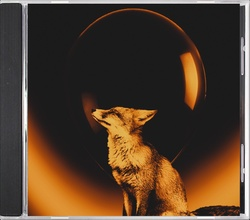
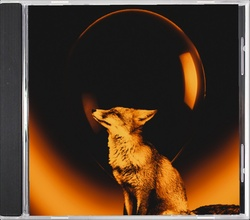
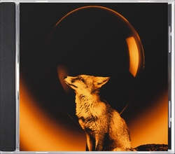
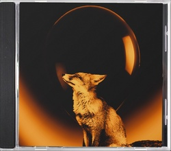

# jewelcase



Tired of your album art having different aspect ratios? Want to make your music
collection look more physical? Just nostalgic for the turn of the millennium?
Meet jewelcase, a silly little program that transforms an image to look like
it's printed and carefully slotted inside a CD jewel case.

## Usage

Add an effect and save as a new file:

```bash
go run github.com/csmith/jewelcase/cmd/jewelcase@latest input.jpg output.jpg
```

Add an effect and save the file in-place

```bash
go run github.com/csmith/jewelcase/cmd/jewelcase@latest --inplace input.jpg
```

Find all images recursively in a directory and add an effect to them all

```bash
go run github.com/csmith/jewelcase/cmd/jewelcase@latest --recursive ./folder
```

By default jewelcase won't process any images that are the exact size of its
output (884×777 pixels), so you can safely use `--recursive` across your entire
library repeatedly without ending up with jewel cases inside jewel cases.
You can override this behaviour by passing the `--force` parameter.

## Effects

| Example                            | Description                                         |
|------------------------------------|-----------------------------------------------------|
|      | Original album art without jewel case               |
|       | Jewel case with no effects applied                  |
|          | Colour adjustment (`--colour=false` to disable)     |
|        | Rounded corners (`--corners=false` to disable)      |
|            | Edge softening (`--edges=false` to disable)         |
|          | Random offset (`--offset=false` to disable)         |
|      | Random rotation (`--rotation=false` to disable)     |
|  | Reflection effect (`--reflection=false` to disable) |
|  | All effects enabled (default)                       |

## Provenance

This project was primarily created with Claude Code, but with a strong guiding
hand. It's not "vibe coded", but an LLM was still the primary author of most
lines of code. I believe it meets the same sort of standards I'd aim for with
hand-crafted code, but some slop may slip through. I understand if you
prefer not to use LLM-created software, and welcome human-authored alternatives
(I just don't personally have the time/motivation to do so).